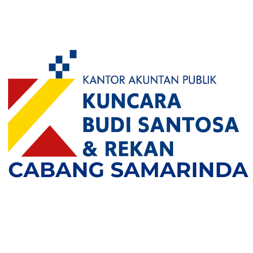

# Portal Apps - KAP Kuncara Budi Santosa & Rekan (Samarinda)



Platform terintegrasi yang dikembangkan oleh Tim Internal KAP Kuncara Budi Santosa & Rekan Cabang Samarinda. Portal ini berfungsi sebagai pusat akses (hub) untuk berbagai alat bantu audit (Audit Tools) guna mendukung efisiensi kerja tim.

🔗 **Akses Website:** [https://kapkbssamarinda.github.io/homepage/](https://kapkbssamarinda.github.io/homepage/)

## 📋 Tentang Proyek

Website ini adalah halaman landas (*landing page*) statis yang mengarahkan auditor ke berbagai aplikasi web spesifik yang digunakan untuk teknik audit, seperti *Monetary Unit Sampling* (MUS) dan pembersihan data (*Data Cleaning*) untuk software akuntansi tertentu.

### Fitur Utama
Portal ini menyediakan akses cepat ke kategori alat berikut:

#### 1. Monetary Unit Sampling (MUS)
Metode sampling statistik untuk pengujian substantif.
* **Standard Sampling (Ver 1.0):** Aplikasi untuk perhitungan sampling unit moneter dasar pada populasi tunggal.
    * *Link:* [MUS V1](https://kapkbssamarinda.github.io/MUS-V1/Jasa.html)
* **Multi-Account Template (Ver 2.0):** Fitur lanjutan yang memungkinkan upload template Excel untuk melakukan sampling pada banyak akun sekaligus.
    * *Link:* [MUS Mode Template](https://kapkbssamarinda.github.io/MUS-Mode-Template/)

#### 2. Data Cleaner
Alat untuk pembersihan (cleaning) dan restrukturisasi data General Ledger (GL) dari software akuntansi agar siap diolah.
* **Accurate™ Cleaner:** Membersihkan format data raw Excel dari software Accurate.
    * *Platform:* Streamlit
* **MYOB GL Helper:** Merestrukturisasi data ekspor General Ledger dari MYOB.
    * *Platform:* Streamlit

> **Catatan untuk Apps Streamlit:** Jika aplikasi tertidur (*sleep*), pengguna perlu mengklik tombol "Yes, get this app back up" pada layar Streamlit untuk mengaktifkannya kembali.

## 🛠️ Teknologi yang Digunakan

Halaman portal ini dibangun menggunakan teknologi web standar:
* **HTML5:** Struktur konten halaman.
* **CSS3:** Penataan gaya (styling) responsif.
* **JavaScript:** Interaktivitas antarmuka (jika ada).
* **GitHub Pages:** Hosting statis untuk portal ini.
* **Streamlit:** Digunakan pada aplikasi backend (Data Cleaner) yang ditautkan di portal ini.

## 📂 Struktur Proyek

```text
/
├── asset/
│   └── icon/
│       ├── LOGO.png
│       └── logo tanpa teks.png
├── index.html        # Halaman utama portal
└── (file pendukung lainnya seperti style.css jika terpisah)
