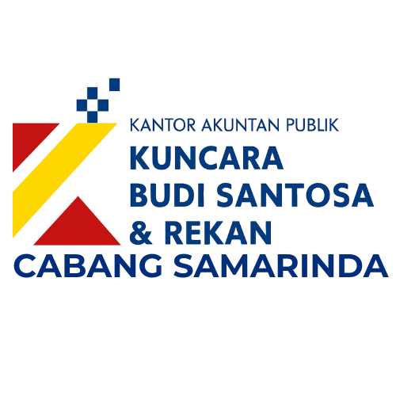

# Portal Alat Audit — KAP Kuncara Budi Santosa & Rekan (Samarinda)



> **Dokumentasi Internal Proyek**  
> *Portal pusat akses (hub) satu pintu untuk seluruh ekosistem aplikasi dan alat bantu audit digital KAP Kuncara Budi Santosa & Rekan Cabang Samarinda.*

---

## 🌐 Akses Langsung
* **Production URL (GitHub Pages):** [https://kapkbssamarinda.github.io/homepage/](https://kapkbssamarinda.github.io/homepage/)
* **Repository GitHub:** [https://github.com/kapkbssamarinda/homepage](https://github.com/kapkbssamarinda/homepage)
* **Lokasi Kantor:** [KAP KBS Cabang Samarinda (Google Maps)](https://maps.app.goo.gl/Us9m17vRAyxCeR8V7)

---

## 📖 Ringkasan Proyek

Repositori ini berisi kode sumber untuk **Portal Halaman Landas (Landing Hub)** internal tim audit KAP Kuncara Budi Santosa & Rekan Cabang Samarinda. Portal ini dirancang khusus agar tim auditor dapat mengakses berbagai alat bantu kerja (Audit Tools berbasis web) secara cepat, terorganisir, dan terstandarisasi.

### Karakteristik & Filosofi Desain:
* **Anti-AI Slop UI System:** Menolak pola klise AI (tanpa gradasi ungu-cyan generik, tanpa floating neon glow, tanpa blurred orb di dark mode, dan tanpa dot status semu). Mengedepankan *Deep Charcoal/Slate Audit Palette* dengan permukaan matte solid, elevasi taktil bertingkat, dan kontras teks WCAG AAA (~15:1).
* **Pencarian Cepat Instan (Quick Filter):** Dilengkapi bilah pencarian responsif zero-dependency untuk memfilter 10 alat audit secara *real-time* berdasarkan nama, deskripsi, atau kategori, lengkap dengan shortcut keyboard `/` dan penanganan *empty state*.
* **Zero Dependencies:** Dibangun dengan HTML5 murni, CSS3 modern modular, dan Vanilla JavaScript tanpa framework atau library pihak ketiga, memastikan performa ultra-ringan dan instan.
* **Dual Theme:** Dukungan tema Terang (Light) dan Gelap (Dark) yang tersimpan di `localStorage` serta sinkron dengan `prefers-color-scheme` sistem pengguna tanpa efek *flicker* (FOUT).
* **PWA Ready:** Dilengkapi konfigurasi Web App Manifest (`manifest.json`) dan icon responsif sehingga dapat di-*install* di desktop maupun perangkat mobile seperti aplikasi native.
* **Aksesibilitas & Tipografi:** Kontras rasio tinggi, fokus keyboard yang jelas (`:focus-visible`), hierarki tipografi Space Grotesk + Inter + JetBrains Mono, serta badge kategori semantik (`.cat-pill`).

---

## 🧭 Direktori Alat Audit (10 Tools Terintegrasi)

Portal saat ini mengelompokkan 10 aplikasi web ke dalam 4 kategori utama:

```
┌────────────────────────────────────────────────────────────────────────┐
│                        PORTAL ALAT AUDIT HUB                           │
├───────────────────┬───────────────────┬────────────────┬───────────────┤
│ 1. Manajemen      │ 2. Data &         │ 3. Konfirmasi  │ 4. Pajak &    │
│    & Tracking     │    Sampling       │                │    Aktuaria   │
├───────────────────┼───────────────────┼────────────────┼───────────────┤
│ • Audit Tracker   │ • MUS Sampling    │ • Piutang      │ • Faktur Pajak│
│                   │ • GL Cleaner      │ • Utang        │ • Merger Bupot│
│                   │ • Rekening Koran  │ • Bank         │ • Aktuaria PUC│
└───────────────────┴───────────────────┴────────────────┴───────────────┘
```

### 1. Manajemen & Tracking (Kategori: `tracker` / Warna Aksen Amber)
| Nama Alat | Tautan Aplikasi | Deskripsi Fungsi |
| :--- | :--- | :--- |
| **Audit Tracker** | [audit-tracker-kap.vercel.app](https://audit-tracker-kap.vercel.app/) | Sistem pelacakan terpusat untuk memantau progres penugasan dan kertas kerja tim audit internal. |

### 2. Data & Sampling (Kategori: `data` / Warna Aksen Navy)
| Nama Alat | Tautan Aplikasi | Deskripsi Fungsi |
| :--- | :--- | :--- |
| **Monetary Unit Sampling (MUS)** | [MUS-Mode-Template](https://kapkbssamarinda.github.io/MUS-Mode-Template/) | Alat sampling audit statistik berbasis *Monetary Unit Sampling* dengan fitur upload template Excel untuk multiple akun sekaligus. |
| **GL (Buku Besar) Cleaner** | [gl-cleaner-eight.vercel.app](https://gl-cleaner-eight.vercel.app/) | Utilitas pembersihan dan perapian data ekspor mentah General Ledger (*raw data*) agar siap diolah di Excel. |
| **Rekening Koran Konverter** | [rek-kon-konverter.vercel.app](https://rek-kon-konverter.vercel.app/) | Konverter file rekening koran bank menjadi struktur tabel data yang terstandarisasi untuk rekonsiliasi bank. |

### 3. Konfirmasi (Kategori: `konf` / Warna Aksen Teal)
| Nama Alat | Tautan Aplikasi | Deskripsi Fungsi |
| :--- | :--- | :--- |
| **Konfirmasi Piutang** | [konfirmasi-piutang-app.vercel.app](https://konfirmasi-piutang-app.vercel.app/) | Generator dan pengelola surat konfirmasi saldo piutang usaha otomatis. |
| **Konfirmasi Utang** | [konfirmasi-utang-app.vercel.app](https://konfirmasi-utang-app.vercel.app/) | Generator dan pengelola surat konfirmasi kewajiban/utang usaha otomatis. |
| **Konfirmasi Bank** | [konfirmasi-bank-app.vercel.app](https://konfirmasi-bank-app.vercel.app/) | Generator surat konfirmasi saldo rekening koran dan fasilitas kredit perbankan klien. |

### 4. Pajak & Aktuaria (Kategori: `pajak` / Warna Aksen Red)
| Nama Alat | Tautan Aplikasi | Deskripsi Fungsi |
| :--- | :--- | :--- |
| **Merger Faktur Pajak** | [merge-faktur-pajak-kkp.vercel.app](https://merge-faktur-pajak-kkp.vercel.app/) | Menggabungkan banyak file ekspor e-Faktur menjadi satu rekapitulasi Kertas Kerja Pemeriksaan (KKP). |
| **Merger Bupot** | [bupot-merger.vercel.app](https://bupot-merger.vercel.app/) | Menggabungkan banyak file bukti potong pajak (PPh) menjadi satu rekapitulasi data KKP pemeriksaan. |
| **Imbalan Pasca Kerja (PUC)** | [puc-v2.vercel.app](https://puc-v2.vercel.app/) | Kalkulator perhitungan aktuaria liabilitas imbalan pasca kerja karyawan menggunakan metode *Projected Unit Credit* (PSAK 24/PP 35). |

---

## 📁 Struktur Berkas Repositori

```text
homepage/
├── asset/
│   └── icon/
│       ├── icon-192.png          # Favicon & icon PWA (192x192 px)
│       ├── icon-512.png          # Icon splash screen PWA (512x512 px)
│       ├── LOGO.png              # Logo identitas utama KAP KBS Samarinda
│       └── logo tanpa teks.png   # Versi logo tanpa teks tipografi
├── index.html                    # Halaman portal utama & markup semantic SVG sprite
├── manifest.json                 # Manifest metadata Progressive Web App (PWA)
├── README.md                     # Dokumentasi komprehensif proyek (file ini)
├── script.js                     # Logika toggle tema Dark/Light & auto year copyright
├── style.css                     # Style token CSS, responsive grid, theme variables
└── sw.js                         # Service Worker unregister/cleanup utility
```

---

## 💻 Panduan Pengembangan & Penggunaan Lokal

Karena portal ini tidak memerlukan build step (`npm run build`, bundler, dll.), proyek dapat dijalankan secara instan di komputer lokal:

### 1. Kloning Repositori
```bash
git clone https://github.com/kapkbssamarinda/homepage.git
cd homepage
```

### 2. Menjalankan di Browser
Pilih salah satu cara berikut:
* **Cara Cepat:** Buka langsung file `index.html` dengan klik dua kali (atau `start index.html` di Windows PowerShell).
* **Menggunakan Local Server (Disarankan untuk testing PWA & path):**
  * Dengan Python:
    ```bash
    python -m http.server 8000
    ```
  * Dengan Node.js (`npx serve` atau `live-server`):
    ```bash
    npx serve .
    ```
  * Melalui ekstensi **Live Server** di VS Code.

---

## 🧩 Panduan Menambah Alat Baru di Masa Mendatang

Untuk asisten AI atau developer yang ingin menambahkan alat/tool baru di sesi berikutnya, ikuti langkah-langkah terstruktur berikut:

1. **Siapkan Icon SVG**:
   - Jika ikon belum ada di sprite `<svg>` pada baris awal `index.html`, tambahkan `<symbol id="i-[nama-ikon]" viewBox="0 0 24 24">...</symbol>` (gunakan path SVG model Lucide/Feather stroke 2).
2. **Tentukan Kategori**:
   - `tracker` (Amber: `--cat-tracker`)
   - `data` (Navy: `--cat-data`)
   - `konf` (Teal: `--cat-konf`)
   - `pajak` (Red: `--cat-pajak`)
   *(Atau buat kategori baru di `style.css` pada bagian CSS custom properties `:root` dan `[data-theme="dark"]`).*
3. **Tambahkan Elemen Kartu ke Grid Terkait**:
   Letakkan blok HTML berikut di dalam `<div class="grid">` pada kategori yang sesuai di `index.html`:
   ```html
   <a class="tool" data-cat="[kategori]" href="https://[url-aplikasi]/" target="_blank" rel="noopener">
       <span class="tool-icon">
           <svg class="icon"><use href="#i-[nama-ikon]"/></svg>
       </span>
       <h3>Nama Aplikasi Baru</h3>
       <p>Deskripsi ringkas 1-2 baris mengenai fungsi alat ini.</p>
       <span class="tool-link">
           <span class="host">[nama-subdomain-pendek]</span>
           <span class="btn-open">Buka <svg class="icon icon-sm arrow"><use href="#i-arrow"/></svg></span>
       </span>
   </a>
   ```
4. **Perbarui Counter**:
   Perbarui teks jumlah alat pada `<span class="group-count">X alat</span>` di bagian header grup terkait.

---

## ⚙️ Detail Arsitektur & Teknis Khusus

* **Pencegahan Flash of Incorrect Theme:**  
  Di dalam tag `<head>` pada `index.html` terdapat skrip inline kecil yang membaca `localStorage.getItem('theme')` atau `matchMedia` sebelum DOM selesai di-render. Atribut `data-theme` langsung diterapkan ke elemen `<html>` agar pengguna tidak mengalami kilatan warna terang saat dalam mode gelap.
* **Service Worker (`sw.js`):**  
  File `sw.js` sengaja dikonfigurasi sebagai *cleanup unregister script* guna mencopot service worker lama yang pernah terdaftar pada domain/port lokal agar tidak mengganggu proyek web lain pada host yang sama.

---

## 👥 Tim & Pengembang

* **Instansi:** Kantor Akuntan Publik (KAP) Kuncara Budi Santosa & Rekan — Cabang Samarinda
* **Tim:** Internal Development Team
* **Kontributor / Lead Developer:** Viany Ramadhany
* **Lisensi / Hak Cipta:** © Hak Cipta Dilindungi. Internal Use Only.
